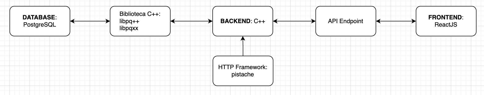
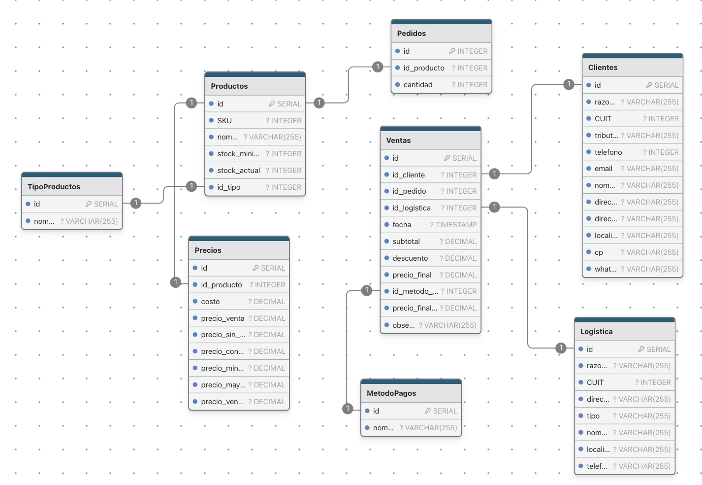

# gestiApp

La aplicacion de gestion de negocio, es un MVP.

Se realizo este proyecto como trabajo practico final de la materia 22.08 Algoritmos y Estructura de Datos - ITBA.

## Importante!
Esta aplicacion tiene un backend hecho en C++ utilizando el [Pistache REST Framework](https://pistacheio.github.io/pistache/). Por el momento solamente 
funciona en entorno Linux. En este proyecto se lo realizo utilizando Ubuntu 24.04.1 LTS.

## Arquitectura principal

### Base de datos
Se utilizo Postgresql como gestor de base de datos relacional. Para el diseño se utilizo [drawdb.app](https://drawdb.app). En la siguiente imagen se muestra las tablas que se crearon y sus relaciones:
